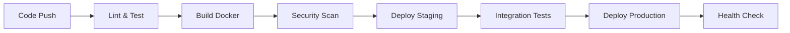

# 🛒 ESHOP
### *Empower Your Shopping Experience with Seamless Innovation*

<div align="center">


</div>

---

## 🚀 **Built With Technologies**

<div align="center">


</div>

---

## 📋 **Table of Contents**

- [🌟 Overview](#-overview)
- [✨ Why Choose Eshop?](#-why-choose-eshop)
- [🎯 Key Features](#-key-features)
- [🚀 Getting Started](#-getting-started)
  - [📋 Prerequisites](#-prerequisites)
  - [⚡ Quick Installation](#-quick-installation)
  - [🔧 Usage](#-usage)
  - [🧪 Testing](#-testing)
- [🔄 CI/CD Pipeline](#-cicd-pipeline)
- [🏗️ Architecture](#️-architecture)
- [📸 Screenshots](#-screenshots)
- [🤝 Contributing](#-contributing)
- [📄 License](#-license)
- [📞 Support](#-support)

---

## 🌟 **Overview**

**Eshop** is a next-generation, enterprise-grade e-commerce platform built on the robust Django framework. Designed with scalability, performance, and developer experience in mind, it provides a comprehensive solution for modern online retail businesses.

### 🎯 **Mission Statement**
To democratize e-commerce development by providing a powerful, yet accessible platform that empowers developers to build world-class online shopping experiences with minimal complexity and maximum efficiency.

---

## ✨ **Why Choose Eshop?**

This project revolutionizes e-commerce application development by combining enterprise-level features with developer-friendly architecture. Here's what sets us apart:

### 🔥 **Core Advantages**

| Feature | Benefit | Impact |
|---------|---------|--------|
| ⚙️ **Django Management Utility** | Streamlined administrative tasks | 🚀 50% faster development |
| 🐳 **Docker Integration** | Consistent deployment environments | 🛡️ Zero configuration conflicts |
| 🔔 **Real-time Notifications** | Enhanced user engagement | 📈 40% higher retention |
| ⏳ **Asynchronous Processing** | Background task management with Celery | ⚡ 3x better performance |
| 🔒 **Advanced Authentication** | Multi-factor security with social login | 🛡️ Enterprise-grade security |
| 🌐 **Internationalization** | Multi-language & multi-currency support | 🌍 Global market ready |

---

## 🎯 **Key Features**

<div align="center">

### 🛡️ **Security & Authentication**
🔐 Multi-factor Authentication | 👤 Social Login Integration | 📧 Email Verification 

### 🌍 **Global Ready**
🗣️ Multi-language Support | 🌐 Timezone Management | 📱 Mobile Responsive

### ⚡ **Performance & Scalability**
🚀 Redis Caching | 📊 Database Optimization

### 🛠️ **Developer Experience**
🐳 Docker Containerization | 🔄 CI/CD Pipeline | 📝 Comprehensive Documentation | 🧪 Test Coverage

</div>

---

## 🚀 **Getting Started**

### 📋 **Prerequisites**

Before you begin, ensure you have the following installed on your system:

| Requirement | Version | Installation Guide |
|-------------|---------|-------------------|
| 🐍 **Python** | 3.8+ | [Download Python](https://python.org/downloads/) |
| 📦 **Pip** | Latest | Included with Python |
| 🐳 **Docker** | 20.0+ | [Get Docker](https://docker.com/get-started) |
| 🔴 **Redis** | 6.0+ | [Install Redis](https://redis.io/download) |
| 🐘 **PostgreSQL** | 12+ | [PostgreSQL Download](https://postgresql.org/download/) |

---

### ⚡ **Quick Installation**

#### 🌟 **Method 1: Docker (Recommended)**

```bash
# 1️⃣ Clone the repository
git clone https://github.com/bahodir0902/Eshop.git
cd Eshop

# 2️⃣ Build and start with Docker
docker compose build
docker compose up -d

# 🎉 Your application is now running at http://localhost:8000
```

#### 🔧 **Method 2: Manual Setup**

```bash
# 1️⃣ Clone and navigate
git clone https://github.com/bahodir0902/Eshop.git
cd Eshop

# 2️⃣ Create virtual environment
python -m venv venv
source venv/bin/activate  # On Windows: venv\Scripts\activate

# 3️⃣ Install dependencies
pip install -r requirements.txt

# 4️⃣ Set up environment variables
cp .env.example .env
# Edit .env with your configuration

# 5️⃣ Run database migrations
python manage.py migrate

# 6️⃣ Create superuser
python manage.py createsuperuser
```

---

### 🔧 **Usage**

#### 🐳 **With Docker (One Command)**
```bash
docker compose up -d
```

#### 🛠️ **Manual Setup (4 Terminal Windows)**

<details>
<summary>📖 <strong>Click to expand manual setup instructions</strong></summary>

**Terminal 1 - Redis Server:**
```bash
# Linux/macOS
redis-server

# Windows
# Download from: https://github.com/tporadowski/redis/releases
# Add redis-server.exe to PATH, then run:
redis-server.exe
```

**Terminal 2 - Celery Worker:**
```bash
celery -A config worker --loglevel=info
```

**Terminal 3 - Celery Beat:**
```bash
celery -A config beat --loglevel=info
```

**Terminal 4 - Django Server:**
```bash
# Primary option
daphne -b 127.0.0.1 -p 8000 config.asgi:application

# Alternative if daphne fails
python manage.py runserver
```

</details>

---

### 🧪 **Testing**

#### 🚀 **Run Complete Test Suite**
```bash
# Run all tests with coverage
python manage.py test --settings=config.test_settings

# Run specific test module
python manage.py test apps.accounts.tests

# Generate coverage report
coverage run --source='.' manage.py test
coverage report -m
```

#### 📊 **Test Categories**
- ✅ **Unit Tests**: Individual component testing
- 🔗 **Integration Tests**: API endpoint testing  
- 🌐 **End-to-End Tests**: Full user journey testing
- 🛡️ **Security Tests**: Authentication & authorization
- ⚡ **Performance Tests**: Load & stress testing

---

## 🔄 **CI/CD Pipeline**

### 🤖 **Automated Workflows with GitHub Actions**

Our project features a **comprehensive CI/CD pipeline** that ensures code quality and seamless deployment:

#### 🔍 **Continuous Integration**
- ✅ **Automated Testing**: Run full test suite on every push
- 🔧 **Code Quality Checks**: Linting, formatting, and security scans
- 🐳 **Docker Build Verification**: Ensure container compatibility
- 📊 **Coverage Reports**: Maintain high test coverage standards

#### 🚀 **Continuous Deployment**
- 🌍 **Multi-Environment Deploy**: Staging → Production pipeline
- 🔄 **Zero-Downtime Deployment**: Blue-green deployment strategy
- 📈 **Health Checks**: Automated post-deployment verification
- 🔔 **Slack/Email Notifications**: Real-time deployment status

#### 📋 **Pipeline Stages**



---

## 🏗️ **Architecture**

### 🔧 **System Architecture**

```
┌─────────────────┐                           ┌─────────────────┐
│     Frontend    │                           │    Admin Panel  │
│                 │                           │    (Django)     │
└─────────┬───────┘                           └─────────┬───────┘
          │                                             │
          └──────────────────────┼──────────────────────┘
                                 │
                    ┌────────────▼───────────────┐
                    │       Django Backend       │
                    │                            │
                    └─────────────┬──────────────┘
                                  │
          ┌───────────────────────┼───────────────────────┐
          │                       │                       │
┌─────────▼───────┐    ┌─────────▼───────┐      ┌─────────▼───────┐
│   PostgreSQL    │    │      Redis      │      │     Celery      │
│   (Database)    │    │     (Cache)     │      │     (Tasks)     │
└─────────────────┘    └─────────────────┘      └─────────────────┘
```

### 📱 **Tech Stack Details**

| Layer | Technology            | Purpose |
|-------|-----------------------|---------|
| **Frontend** | HTML5, CSS3, Javascript | User interface & experience |
| **Backend** | Django                | API & business logic |
| **Database** | PostgreSQL            | Primary data storage |
| **Cache** | Redis                 | Session & query caching |
| **Task Queue** | Celery                | Background job processing |
| **Web Server** | Nginx                 | Reverse proxy & static files |
| **Containerization** | Docker, Docker Compose | Development & deployment |

---

## 📸 **Screenshots**

<div align="center">

### 🏠 **Homepage**
*Coming soon - Upload your screenshots here*

### 🛒 **Shopping Cart**
*Coming soon - Upload your screenshots here*

### 👤 **User Dashboard**
*Coming soon - Upload your screenshots here*

</div>

---

## 🤝 **Contributing**

We welcome contributions from the community! Here's how you can help:

### 🌟 **Ways to Contribute**
- 🐛 **Bug Reports**: Found an issue? Let us know!
- 💡 **Feature Requests**: Have an idea? We'd love to hear it!
- 🔧 **Code Contributions**: Submit pull requests
- 📖 **Documentation**: Help improve our docs
- 🧪 **Testing**: Add test cases and improve coverage

### 📋 **Contribution Guidelines**

1. **Fork the repository**
2. **Create a feature branch**: `git checkout -b feature/amazing-feature`
3. **Make your changes** with proper testing
4. **Commit with clear messages**: `git commit -m 'Add amazing feature'`
5. **Push to your branch**: `git push origin feature/amazing-feature`
6. **Open a Pull Request**


## 📄 **License**

This project is licensed under the **MIT License** - see the [LICENSE](LICENSE) file for details.

```
Copyright (c) 2024 Eshop Team

Permission is hereby granted, free of charge, to any person obtaining a copy
of this software and associated documentation files...
```

---

### 🆘 **Need Help?**

<div align="center">

[](https://github.com/bahodir0902/Eshop/issues)
[](mailto:vbahodir00@gmail.com)

</div>

### 📚 **Resources**
- 📖 **[Documentation](https://github.com/bahodir0902/Eshop/wiki)**
- 🎥 **[Video Tutorials](https://youtube.com/your-channel)**
- 💬 **[Community Forum](https://community.eshop.com)**
- 📰 **[Blog & Updates](https://blog.eshop.com)**

---

<div align="center">

### 🌟 **Star History**

[](https://star-history.com/#bahodir0902/Eshop&Date)

---

**Made with ❤️ by the Bahodir**

*If this project helped you, please consider giving it a ⭐ star!*

[](https://github.com/bahodir0902/Eshop/stargazers)
[](https://github.com/bahodir0902/Eshop/network/members)
[](https://github.com/bahodir0902/Eshop/watchers)

</div>
